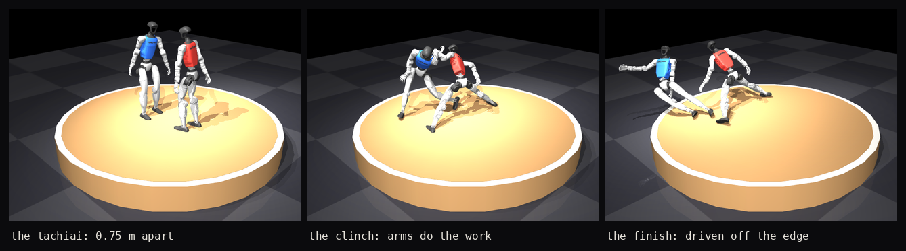

<p align="center">
  
</p>

# Automata League Sumo

The wrestling competition environment of the **Automata League**: two humanoid robots
inside a raised circular ring, each trying to put the other **out of the ring or down on
the ground**, by any physical means, in [MuJoCo](https://mujoco.org/). Unitree **G1** ships
as the example robot; plug in your own the same way (see
[Adding a custom robot](#adding-a-custom-robot)). The examples train with
[TorchRL](https://github.com/pytorch/rl) PPO through **self-play**, GPU parallel via
[MuJoCo Warp](https://github.com/google-deepmind/mujoco_warp); any other TorchRL agent can
be used the same way (see [Training](#training)).

Sibling of [automataleague-parkour](https://github.com/AutomataLeague/automataleague-parkour),
whose architecture this mirrors.

## Setup

```bash
uv sync                              # core: environment building and rendering
uv sync --extra train --extra gpu    # adds torch, torchrl, MuJoCo Warp (GPU box)
```

Headless rendering needs a GL backend: `MUJOCO_GL=egl`.

## The sumo environment

<p align="center">
  
</p>

<p align="center">
  <sub>One real duel driven by the trained policy, 71 steps (1.4 s). Side A wears blue, side B red.</sub>
</p>

The task lives in `automataleague_sumo/envs/sumo/`. Environments are named and versioned in
a registry (`automataleague_sumo/envs/registry.py`) and imported by id.

| Environment | Ring | Spawn | Loss conditions | Difficulty levels |
|---|---|---|---|---|
| **`sumo-1`** | 1.5 m radius, raised 0.3 m | facing off 0.75 m apart (tachiai) | out of the ring, foot off the edge, base too low, tilt past 50° | none — the opponent **is** the difficulty |

```python
import numpy as np
from automataleague_sumo import make_env, list_environments

list_environments()                                       # [EnvSpec(env_id="sumo-1", ...)]

# single CPU env (for rendering or evaluation) — one duel
env = make_env("sumo-1", robot="g1", backend="cpu")
obs_a, obs_b = env.reset(seed=0)

n = env.scene.a.robot.action_dim                          # 29 for the G1
(obs_a, obs_b), (rew_a, rew_b), terminated, truncated, info = env.step(
    np.zeros(n), np.zeros(n))                             # your policy goes here
# info["outcome"]: 1 = A won, 2 = B won, 3 = draw

# batched GPU env (for training) — num_envs parallel DUELS, each holding both robots
env = make_env("sumo-1", robot="g1", backend="warp", num_envs=2048)
```

* Both sides are ordinary policy rows, so you drive each one yourself. Under self-play the
  policy batch is `2 * num_envs`.
* `opponent="self"` is the real game and the default; `opponent="zero"` is a passive dummy
  that cannot lose, used only to bootstrap standing on a fresh robot.
* Observations are `3 * n_joints + 23` wide, derived from the robot, and expressed entirely
  in each robot's own base frame. A rigid rotation of the whole arena leaves them unchanged,
  which is what makes **one shared policy valid for both sides**.
* Override any config field inline, e.g. `make_env("sumo-1", robot="g1", ring_radius=2.0)`.
* **A duel is always one robot against the same robot.** The robot is the fixed hardware
  and the policy is what competes, so a matchup measures the algorithm rather than the
  chassis. Bring any robot you like and run a league in it; just not two different ones in
  the same ring.

### No difficulty levels, no opponent pool

There is no curriculum ladder, on purpose. In a competitive game the difficulty **is** the
opponent, and under self-play it tracks the policy's own strength; an authored schedule of
environment levels would be a second difficulty knob fighting the first.

There is also no opponent pool. Sampling past checkpoints exists to stop self-play cycling
between exploitable strategies, and cycling needs a discrete strategy space to cycle in.
Measured here across two runs, **0 of 336 and 0 of 504** ordered triples cycle, so
improvement is a strict ordering and a pool would buy nothing. If that ever changes it
shows up directly in `tools/round_robin.py`, and a pool can be added then.

### The reward

| term | what it pays for | weight |
|---|---|---|
| `win` | putting the opponent out or down. Terminal, zero sum. | 10.0 |
| `push` | driving them from the centre toward the rim | 3.0 |
| `alive` | a whole episode spent standing | 2.0 |
| `centre` | a whole episode pinned against the rim (a penalty) | 1.0 |
| `action`, `joint_vel` | regularizers | 0.5 each |

**Every weight is a whole-episode value**, so they compare directly to each other and to
`win`, and `RewardConfig` refuses to construct if the shaping budget can outscore a win.
`push` is a delta on the opponent's radius, so it telescopes across the episode and cannot
be farmed by shoving them out and letting them back in.

## Training

One entry point in `examples/`, run from the repo root. Hydra config is
`examples/config_ppo.yaml`; any value can be overridden on the command line.

```bash
# bootstrap standing against a passive dummy on a fresh robot
MUJOCO_GL=egl uv run python examples/ppo_sumo.py run_name=standing \
    env.arena.opponent=zero env.reward_weights.push=0

# the real game, warm-started from it
MUJOCO_GL=egl uv run python examples/ppo_sumo.py run_name=sumo1 \
    env.num_envs=2048 collector.total_frames=1_000_000_000 \
    init_checkpoint=checkpoints/standing/ppo_best.pt
```

* Override anything via Hydra, e.g. `collector.total_frames=20_000_000 env.num_envs=4096`.
* Checkpoints are written to `checkpoints/<run_name>/`, alongside a `metrics.jsonl` with
  every batch. Weights and Biases is on by default; `logger.backend=""` disables it.
* The shipped policy took **1B frames** of self-play. Frame counts are the reproducible
  quantity here; wall-clock depends entirely on your GPU.

> **[training-recipe.md](training-recipe.md)** is the full walkthrough: how the shipped
> policy was actually trained, the check to run at each stage before spending the next
> block of GPU time, and the things that went wrong. Two of them are worth knowing before
> your first run:
>
> * **Self-play win rate is pinned at exactly 0.5** by construction and carries no
>   information, and training reward is near-flat whether a run is healthy or has silently
>   gone NaN. `tools/round_robin.py` is the only absolute progress measure.
> * **The last checkpoint is frequently not the best one** — an earlier one won four
>   separate times here. Pick with the round robin, not by recency.

## Evaluation

```bash
MUJOCO_GL=egl uv run python tools/round_robin.py checkpoints/sumo1/ppo_eval_*.pt
MUJOCO_GL=egl uv run python tools/render_policy.py checkpoints/sumo1/ppo_best.pt -o duel.mp4
MUJOCO_GL=egl uv run python tools/render_versus.py old.pt new.pt -o versus.mp4
```

### Entering a policy that this repo did not train

Evaluation runs through a contract, not through our PPO actor, so any algorithm can
compete. A competitor is anything that maps a batch of observations to a batch of actions:

```python
from automataleague_sumo.policy import Policy, PolicyInfo, check_policy, register_loader

class MyPolicy(Policy):
    info = PolicyInfo(env_id="sumo-1", robot="g1", algorithm="sac", label="sac-500M")

    def act(self, observation):        # [B, obs_dim] -> [B, act_dim] in [-1, 1]
        return self.net(observation).tanh()

register_loader("my-format", lambda path, device: MyPolicy(...))
```

`automataleague_sumo.policy` imports without torchrl, hydra or mujoco, because a submission
may use none of them. `check_policy` runs before every tournament and rejects the ways a
policy can be *quietly* wrong rather than loudly broken: wrong action width, non-finite or
out-of-range actions, non-determinism, and batch coupling — both robots in a duel share one
call, so a policy that normalises across the batch makes each robot's action depend on its
opponent's observation while looking entirely healthy.

Training code for other algorithms does not belong here. This repo ships PPO as the
reference; bring your own and register a loader.

Two hand-written baselines prove the contract admits a policy this repo did not train, and
give a tournament a fixed floor to be read against:

```bash
uv run python tools/make_baseline.py still -o baselines/still.pt
MUJOCO_GL=egl uv run python tools/round_robin.py baselines/still.pt checkpoints/sumo1/*.pt
```

They have no weights, no torchrl and no hydra config. `still` does nothing; `lean` leans
toward the opponent and is **worse than doing nothing** (2.5% against a field where `still`
scored 22.3%), which is a useful reminder that a plausible idea needs measuring.

`tools/` also holds the preflight checks (`reward_balance.py`, `baselines.py`,
`warp_smoke.py`), the capability measurements (`measure_reach.py`,
`policy_saturation.py`), and `push_test.py`. Each one exists because it caught a real
defect no training curve showed; `training-recipe.md` says which.

## Adding a custom robot

A robot is a `RobotSpec` (`automataleague_sumo/robots/base.py`), the whole contract a task
needs. Observation and action sizes are **derived from the joint count**, so a robot with a
different number of joints plugs into the same env, reward, and PPO code with no changes to
any of them. `automataleague_sumo/robots/g1.py` is the worked example.

**1. Vendor the model** under `assets/<name>/`, keeping the upstream `LICENSE`.

**2. Write the factory** in `automataleague_sumo/robots/<name>.py`, reading every field off
the model's own `home` keyframe and docs.

**3. Audit the collision model against *this* task.** Menagerie's MJX variants are stripped
for locomotion, where only the feet touch anything. For wrestling that is backwards: the
G1's had **12 of 30 bodies with no collision geom at all**, including both shoulders and
both forearms, and it was missing **56% of all robot-to-robot contact**. That capped
training at a plateau we spent two 1B-frame runs against. `RobotSpec.extra_colliders`
grafts primitives on at load time with `mass=0`, so inertia is unchanged and `assets/`
stays byte-identical.

**4. Measure the action scale**, do not guess it. `action_scale` is a symmetric window
around the *home* pose, so one number cannot serve a whole robot: at a uniform 0.5 the G1's
elbows could never get within 45° of straight, and the arms simply hung. Use
`tools/measure_reach.py` and `RobotSpec.joint_scale` for per-joint multipliers.

Once your `RobotSpec` exists you can train it, evaluate it and run a full league in it. What
you cannot do is put **two different robots in the same duel**: both backends raise
`NotImplementedError` when the sides differ.

That is a rule, not a missing feature. A league is only a fair test of an algorithm if both
sides run the same hardware; otherwise a result measures the chassis. It is also what keeps
the design honest, because a single shared policy can drive both contestants only while
their observation and action widths match. The analysis of what mixed matchups would cost is
kept in [#1](https://github.com/AutomataLeague/automataleague-sumo/issues/1) if the rule
ever changes.

## Adding a custom reward

Reward weights are a `RewardConfig` (`automataleague_sumo/envs/sumo/config.py`); the terms
are combined in `compute_reward` (`automataleague_sumo/envs/sumo/rewards.py`).

**Retune existing terms** (no code):

```python
from automataleague_sumo.envs.sumo.config import RewardConfig
env = make_env("sumo-1", robot="g1", reward_cfg=RewardConfig(win=10.0, push=5.0))
```
```bash
MUJOCO_GL=egl uv run python examples/ppo_sumo.py env.reward_weights.push=5.0
```

**Add a new term** (two edits): add a weight field to `RewardConfig`, compute it in
`compute_reward` and add it to the returned sum. Then expose it under `reward_weights` in
`examples/config_ppo.yaml` to control it from training.

Whatever you change, run `tools/reward_balance.py` before training. It prints every term
against `win` and exits non-zero if the reward does not pay for the behaviour you are
asking for. The shipped weights once made surviving at the spawn radius worth −0.130 per
step, so the optimal policy was to creep inward rather than stand, and every training curve
looked like progress.

## Tests

```bash
MUJOCO_GL=egl uv run pytest              # CPU suite
MUJOCO_GL=egl uv run pytest -m gpu       # + CUDA and mujoco-warp
```

## Roadmap

* **An Elo leaderboard** over the round-robin results, so tournaments become comparable
  across runs rather than only within one field.
* **Opponent posture in the observation.** A policy currently sees only 10 numbers about
  its opponent: relative position, relative velocity, heading and one contact flag. Nothing
  about its joint state or how it is leaning.

## Licence

Apache-2.0, see [LICENSE](LICENSE). Vendored robot models keep their upstream
licences.

## Credits

* G1 model © Unitree Robotics, from MuJoCo Menagerie (BSD 3-Clause). See
  `assets/unitree_g1/LICENSE`.
